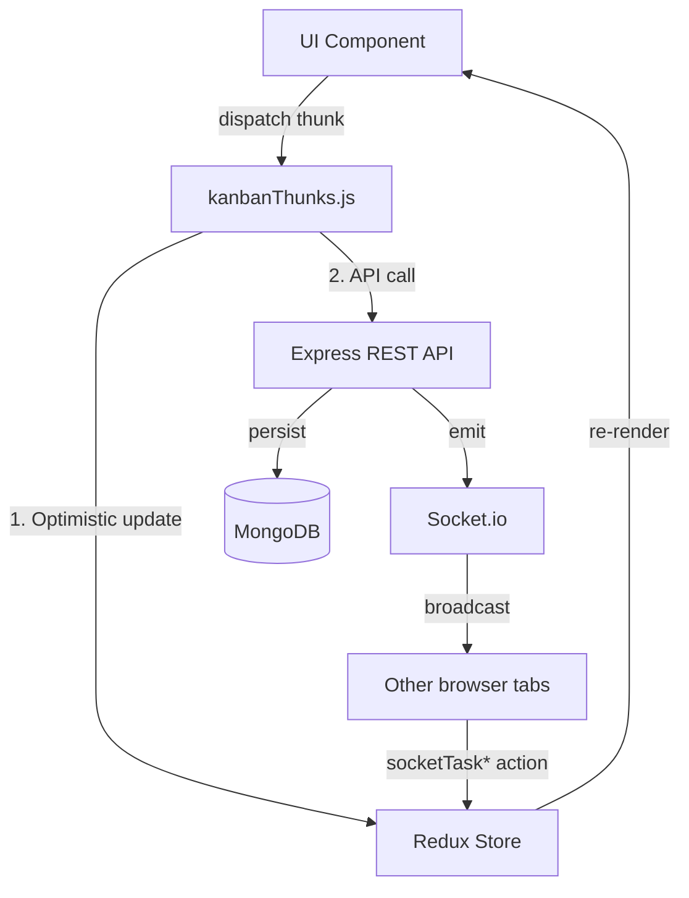

<div align="center">
  <div style="background-color: #6366f1; width: 64px; height: 64px; border-radius: 16px; display: flex; align-items: center; justify-content: center; margin: 0 auto 20px;">
    <svg xmlns="http://www.w3.org/2000/svg" width="32" height="32" viewBox="0 0 24 24" fill="none" stroke="white" stroke-width="2" stroke-linecap="round" stroke-linejoin="round"><path d="M22 11.08V12a10 10 0 1 1-5.93-9.14"></path><polyline points="22 4 12 14.01 9 11.01"></polyline></svg>
  </div>

  <h1 align="center">TaskFlow Pro</h1>

  <p align="center">
    A full-stack, real-time collaborative project management & productivity SaaS application.
    <br />
    Built on the <strong>MERN stack</strong> — MongoDB · Express · React · Node.js — with Socket.io, JWT auth, and a zero-Firebase local backend.
  </p>

  <p align="center">
    <a href="#features">Features</a> •
    <a href="#tech-stack">Tech Stack</a> •
    <a href="#architecture">Architecture</a> •
    <a href="#api-reference">API Reference</a> •
    <a href="#getting-started">Getting Started</a>
  </p>
</div>

<hr />

## 🌟 Overview

**TaskFlow Pro** started as a frontend-only React app. It has been fully migrated into a **production-grade MERN monorepo** running entirely on localhost — no Firebase, no third-party auth, no external database.

The backend is a custom **Express + MongoDB** server featuring:
- **JWT authentication** (access + refresh token rotation)
- **Real-time collaboration** via Socket.io (tasks sync live across browser tabs)
- **REST API** with 16+ endpoints covering auth, projects, tasks, users, file uploads, activity feeds, and analytics
- **MongoDB aggregation pipelines** powering the analytics dashboard

The frontend is a blazing-fast **Vite + React 18** app with Redux Toolkit, @dnd-kit drag-and-drop, Framer Motion animations, and a full command palette — all now wired to the real backend instead of seed data.

---

## 🚀 Key Features

### 🔐 Authentication
- Secure **JWT-based auth** with 15-minute access tokens and 7-day refresh tokens
- Refresh tokens stored in **httpOnly cookies** (XSS-safe)
- **Silent token refresh** — axios interceptor transparently re-authenticates on 401
- Auto-creates a default **Workspace** on registration

### 🗂 Project & Task Management
- **Full CRUD** for projects and tasks via REST API, persisted to MongoDB
- **Kanban board** with 4 default columns: To Do → In Progress → In Review → Done
- **Optimistic UI** — drag-and-drop updates the UI instantly, then syncs to the server in the background
- Task metadata: priority levels, due dates, tags, assignees, and file attachments

### ⚡ Real-Time Collaboration (Socket.io)
- Socket.io server with **JWT auth handshake** — unauthenticated sockets are rejected
- Users **join project rooms** and receive live events when any collaborator mutates a task
- Events: `task:created`, `task:moved`, `task:updated`, `task:deleted`
- Redux reducers (`socketTask*`) handle incoming events — no page refresh needed

### 📁 File Uploads
- **Multer-powered** file upload endpoint for task attachments
- Supports `.jpg`, `.jpeg`, `.png`, `.pdf`, `.docx`, `.xlsx` — up to **10 MB**
- Files served as static assets at `http://localhost:5000/uploads/`

### 📊 Analytics API
- MongoDB **aggregation pipelines** compute:
  - Tasks per column (pipeline stage distribution)
  - Tasks per priority
  - Tasks per assignee (with user lookup)
  - Activity counts over the last 7 days (daily time series)
  - Completion rate percentage
- Recharts dashboard consumes live data from the API

### 📋 Activity Feed
- Every task mutation (create / move / update) writes an `ActivityLog` document
- `/api/tasks/activity/:projectId` returns the last 50 logs, populated with user names and task titles
- Powers the sidebar "Recent Activity" feed

### ⏱ Focus / Pomodoro Workspace
- Integrated Pomodoro timer running in global Redux state — persists across page navigation
- Session logging, streak tracking, and calendar heatmap analytics

### 🎨 UI / UX
- **Dark / Light mode** toggle with system preference detection
- Global **Command Palette** (`Ctrl+K` / `Cmd+K`) — instant search and navigation
- **Framer Motion** micro-animations throughout
- Fully responsive layout

---

## 🛠 Tech Stack

### Backend (`server/`)
| Layer | Technology |
|-------|-----------|
| Runtime | Node.js 18+ |
| Framework | Express 4 |
| Database | MongoDB 7 + Mongoose 8 |
| Authentication | JSON Web Tokens (`jsonwebtoken`) + `bcryptjs` |
| Real-Time | Socket.io 4 |
| File Uploads | Multer |
| Security | Helmet, CORS, express-rate-limit |
| Logging | Morgan |
| Validation | Zod |
| Dev Server | Nodemon |

### Frontend (`src/`)
| Layer | Technology |
|-------|-----------|
| Framework | React 18 + Vite 5 |
| State | Redux Toolkit (RTK) |
| Routing | React Router v6 |
| HTTP Client | Axios (custom instance with interceptors) |
| WebSocket | socket.io-client |
| Drag & Drop | @dnd-kit/core + @dnd-kit/sortable |
| Animations | Framer Motion |
| Forms | React Hook Form + Zod |
| Styling | Tailwind CSS v3 |
| Icons | Lucide React |
| Charts | Recharts |
| Toasts | react-hot-toast |
| Command Menu | CMDK |

---

## 🧠 System Architecture

```
┌─────────────────────────────────────────────────────────┐
│                    React Frontend (Vite)                 │
│                    localhost:5173                        │
│                                                         │
│  Redux Store          Axios Instance      Socket.io      │
│  ┌──────────┐        ┌──────────────┐   ┌──────────┐   │
│  │ authSlice│        │ /api proxy   │   │useSocket │   │
│  │kanbanSlice│◄──────│ interceptors │   │  hook    │   │
│  │focusSlice│        │ silent refresh│  └────┬─────┘   │
│  └──────────┘        └──────┬───────┘        │         │
└─────────────────────────────┼────────────────┼─────────┘
                               │ REST           │ WS
                    ┌──────────▼────────────────▼─────────┐
                    │       Express Server                  │
                    │       localhost:5000                  │
                    │                                      │
                    │  JWT Middleware → Controllers         │
                    │  /api/auth   /api/projects           │
                    │  /api/tasks  /api/users              │
                    │  /api/analytics                      │
                    │                   Socket.io Server   │
                    │  Multer (uploads/) ← File Storage    │
                    └──────────────────┬───────────────────┘
                                       │ Mongoose
                    ┌──────────────────▼───────────────────┐
                    │          MongoDB                      │
                    │    taskflow-pro database             │
                    │                                      │
                    │  users · workspaces · projects       │
                    │  tasks · activitylogs                │
                    └──────────────────────────────────────┘
```

### Data Flow (State Management)



### Server File Structure

```
server/
├── server.js                    ← entry point: Express + Socket.io + routes
├── package.json
├── .env                         ← MONGO_URI, JWT secrets
├── uploads/                     ← local file storage (gitignored)
└── src/
    ├── config/
    │   ├── db.js                ← mongoose.connect()
    │   └── socket.js            ← Socket.io init + JWT handshake middleware
    ├── models/
    │   ├── User.js              ← bcrypt pre-save hook, comparePassword()
    │   ├── Workspace.js         ← auto-created on registration
    │   ├── Project.js           ← columns array, members array
    │   ├── Task.js              ← compound index on (project, columnId)
    │   └── ActivityLog.js       ← audit trail for all task mutations
    ├── middleware/
    │   ├── auth.js              ← Bearer token → req.user
    │   ├── errorHandler.js      ← global ApiError handler
    │   └── upload.js            ← multer, 10MB, file type filter
    ├── services/
    │   └── token.service.js     ← generateAccessToken / generateRefreshToken / verify*
    ├── controllers/
    │   ├── auth.controller.js   ← register, login, refreshToken, logout
    │   ├── project.controller.js
    │   ├── task.controller.js   ← emits socket events on every write
    │   ├── user.controller.js   ← profile + avatar upload
    │   └── analytics.controller.js ← aggregation pipelines
    └── routes/
        ├── auth.routes.js
        ├── project.routes.js
        ├── task.routes.js       ← includes /activity/:projectId
        ├── user.routes.js
        └── analytics.routes.js
```

---

## 📡 API Reference

### Auth
| Method | Endpoint | Auth | Description |
|--------|----------|------|-------------|
| POST | `/api/auth/register` | — | Create account + default workspace |
| POST | `/api/auth/login` | — | Returns `accessToken` + sets refresh cookie |
| POST | `/api/auth/refresh-token` | Cookie | Silent access token refresh |
| POST | `/api/auth/logout` | ✅ | Clears tokens |

### Users
| Method | Endpoint | Auth | Description |
|--------|----------|------|-------------|
| GET | `/api/users/me` | ✅ | Get own profile |
| PATCH | `/api/users/me` | ✅ | Update name, avatar, etc. |
| POST | `/api/users/me/avatar` | ✅ | Upload avatar image |

### Projects
| Method | Endpoint | Auth | Description |
|--------|----------|------|-------------|
| GET | `/api/projects` | ✅ | All user's projects |
| POST | `/api/projects` | ✅ | Create project (auto-creates 4 columns) |
| GET | `/api/projects/:id` | ✅ | Get single project |
| PATCH | `/api/projects/:id` | ✅ | Update project |
| DELETE | `/api/projects/:id` | ✅ | Delete project |

### Tasks
| Method | Endpoint | Auth | Description |
|--------|----------|------|-------------|
| GET | `/api/tasks/project/:id` | ✅ | Get all tasks for a project |
| POST | `/api/tasks/project/:id` | ✅ | Create task + log activity + emit socket |
| PATCH | `/api/tasks/:id` | ✅ | Update task fields |
| PATCH | `/api/tasks/:id/move` | ✅ | Move to new column (logs + emits) |
| DELETE | `/api/tasks/:id` | ✅ | Delete task + emit socket |
| POST | `/api/tasks/:id/attachments` | ✅ | Upload file attachment |
| GET | `/api/tasks/activity/:projectId` | ✅ | Last 50 activity logs |

### Analytics
| Method | Endpoint | Auth | Description |
|--------|----------|------|-------------|
| GET | `/api/analytics/:projectId/summary` | ✅ | Tasks by column, priority, assignee; activity time series; completion rate |

---

## 💻 Getting Started

### Prerequisites

| Tool | Version | Notes |
|------|---------|-------|
| Node.js | 18+ | [nodejs.org](https://nodejs.org) |
| MongoDB Community | 7.x | [mongodb.com](https://www.mongodb.com/try/download/community) |
| npm | 9+ | Comes with Node |

### Installation

1. **Clone the repository**
   ```bash
   git clone https://github.com/yourusername/taskflow-pro.git
   cd taskflow-pro
   ```

2. **Install frontend dependencies**
   ```bash
   npm install
   ```

3. **Install backend dependencies**
   ```bash
   cd server
   npm install
   cd ..
   ```

4. **Configure environment variables**

   `server/.env` (already present — update secrets for production):
   ```env
   PORT=5000
   MONGO_URI=mongodb://localhost:27017/taskflow-pro
   JWT_SECRET=your_super_secret_jwt_key_change_this
   JWT_REFRESH_SECRET=your_super_secret_refresh_key_change_this
   NODE_ENV=development
   CLIENT_ORIGIN=http://localhost:5173
   ```

   `client/.env` (root `.env`):
   ```env
   VITE_API_URL=http://localhost:5000/api
   ```

### Running Locally

> ⚠️ You need **three terminals** (or MongoDB running as a Windows service).

**Terminal 1 — Start MongoDB** *(skip if MongoDB is already a service)*
```powershell
# Windows (run as Administrator)
& "C:\Program Files\MongoDB\Server\7.0\bin\mongod.exe" --dbpath "C:\data\db"
```

**Terminal 2 — Start Express backend**
```bash
cd server
npm run dev
# → 🚀 Server running on http://localhost:5000
```

**Terminal 3 — Start React frontend**
```bash
npm run dev
# → App running on http://localhost:5173
```

### Verify Everything Works
1. Open http://localhost:5173 → register a new account
2. Open **MongoDB Compass** → connect to `mongodb://localhost:27017` → check the `taskflow-pro` database has a `users` and `workspaces` collection
3. Log in → create a project → create a task → verify it appears in the `tasks` collection
4. Open **two browser tabs** → move a card in one → it should move in the other tab in real time (Socket.io ✅)

---

## 🗂 Frontend File Reference

### New Files Added
| File | Purpose |
|------|---------|
| `src/api/axiosInstance.js` | Central axios with auth header injection + silent 401 refresh |
| `src/hooks/useSocket.js` | Connects to Socket.io, joins project room, dispatches Redux on events |

### Updated Files
| File | What Changed |
|------|-------------|
| `src/features/auth/authSlice.js` | Replaced Firebase stubs with `loginUser`, `registerUser`, `logoutUser` async thunks |
| `src/features/kanban/kanbanSlice.js` | Added `fetchTasks`, `createTaskAPI`, `moveTaskAPI`, `deleteTaskAPI`, `updateTaskAPI`, `fetchProjects`, `createProjectAPI` + socket reducers (`socketTaskMoved/Created/Updated/Deleted`) + task normalizer helpers |
| `src/features/kanban/kanbanThunks.js` | Optimistic UI now persists to API; delegates to slice thunks |
| `vite.config.js` | Added `/api` → `http://localhost:5000` dev proxy |

---

## 🔌 Socket.io Real-Time Events

| Event | Direction | Payload | Triggered By |
|-------|-----------|---------|-------------|
| `task:created` | Server → Clients | Full task object | POST `/api/tasks/project/:id` |
| `task:moved` | Server → Clients | `{ taskId, toColumnId, toIndex }` | PATCH `/api/tasks/:id/move` |
| `task:updated` | Server → Clients | Full task object | PATCH `/api/tasks/:id` |
| `task:deleted` | Server → Clients | `{ taskId }` | DELETE `/api/tasks/:id` |

Add `useSocket(currentProjectId)` to the KanbanBoard component to activate live sync.

---

<div align="center">
  <p>Built with ❤️ by Aditya — Full-Stack MERN · Real-Time · Production Architecture</p>
</div>


