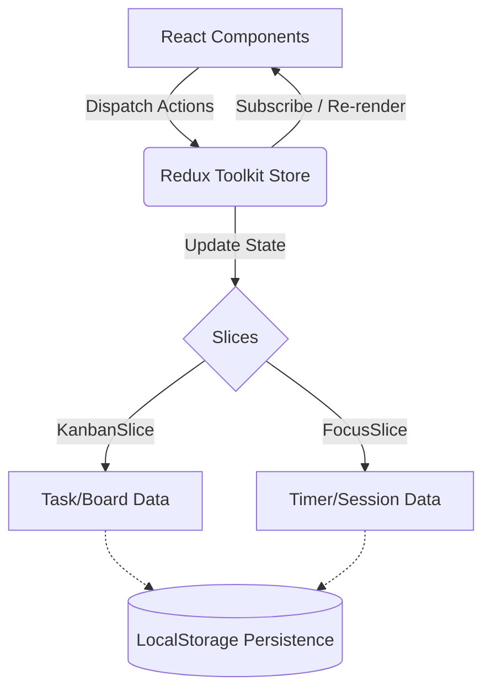

<div align="center">
  <div style="background-color: #6366f1; width: 64px; height: 64px; border-radius: 16px; display: flex; align-items: center; justify-content: center; margin: 0 auto 20px;">
    <svg xmlns="http://www.w3.org/2000/svg" width="32" height="32" viewBox="0 0 24 24" fill="none" stroke="white" stroke-width="2" stroke-linecap="round" stroke-linejoin="round"><path d="M22 11.08V12a10 10 0 1 1-5.93-9.14"></path><polyline points="22 4 12 14.01 9 11.01"></polyline></svg>
  </div>
  
  <h1 align="center">TaskFlow Pro</h1>

  <p align="center">
    A production-grade, collaborative project management & productivity SaaS application.
    <br />
    Built to demonstrate advanced frontend architecture, state management, and modern UI/UX principles.
  </p>

  <p align="center">
    <a href="#features">Features</a> •
    <a href="#tech-stack">Tech Stack</a> •
    <a href="#architecture">Architecture</a> •
    <a href="#getting-started">Getting Started</a>
  </p>
</div>

<hr />

## 🌟 Overview

**TaskFlow Pro** is designed to merge the best of project management (Kanban) with personal productivity (Focus tracking). Inspired by industry leaders like Linear and Notion, the application features a blazing-fast, keyboard-centric interface with seamless drag-and-drop capabilities, real-time focus timers, and dynamic analytics. 

This project was built from the ground up to showcase mastery over the modern **React ecosystem**, highlighting complex state management, performance optimization, and premium aesthetic design.

---

## 🚀 Key Features

* **Advanced Kanban Board**: Full drag-and-drop task management built with `@dnd-kit`. Supports optimistic UI updates, multi-column sorting, and complex task metadata (priorities, labels, due dates).
* **Global Command Palette**: Hit `Cmd+K` (or `Ctrl+K`) anywhere in the app to instantly search through tasks or navigate between boards and dashboards.
* **Integrated Pomodoro Workspace**: A dedicated focus timer that runs in a global Redux state. Start your timer, navigate to other pages, and your focus session will continue ticking and automatically log upon completion.
* **Productivity Analytics**: A comprehensive dashboard featuring a dynamic calendar heatmap, streak tracking, and accumulated focus time metrics.
* **Theming**: Fully responsive Dark/Light mode switching built natively with Tailwind CSS.

---

## 🛠 Tech Stack & Tooling

Every tool was carefully selected to represent enterprise-level standards.

### Core Architecture
* **[React 18](https://react.dev/)**: Utilized functional components, custom hooks, and concurrent features.
* **[Vite](https://vitejs.dev/)**: Chosen over Create React App for blazing-fast HMR and optimized production bundling.
* **[Redux Toolkit (RTK)](https://redux-toolkit.js.org/)**: Manages complex global state (Kanban data, Focus sessions) eliminating prop-drilling. Uses normalized state shapes for optimal performance.
* **[React Router v6](https://reactrouter.com/)**: Handles nested routing, layout wrappers, and protected route logic.

### UI & Styling
* **[Tailwind CSS v3](https://tailwindcss.com/)**: Utility-first CSS for rapid, maintainable styling. Configured with custom design tokens (brand colors, typography).
* **[Framer Motion](https://www.framer.com/motion/)**: Powers the fluid micro-interactions and layout transitions across the app.
* **[Lucide React](https://lucide.dev/)**: Beautiful, consistent open-source iconography.
* **[clsx](https://github.com/lukeed/clsx) & [tailwind-merge](https://github.com/dcastil/tailwind-merge)**: Utility combination for elegant, conflict-free dynamic class name generation.

### Forms & Interactions
* **[@dnd-kit](https://dndkit.com/)**: A lightweight, performant, and accessible drag-and-drop toolkit used for the Kanban board.
* **[React Hook Form](https://react-hook-form.com/)**: High-performance, flexible, and extensible form management.
* **[Zod](https://zod.dev/)**: TypeScript-first schema validation applied to forms (e.g., Task creation/editing) to ensure data integrity before dispatching to Redux.
* **[CMDK](https://cmdk.paco.me/)**: A fast, accessible command menu interface for global search.

---

## 🧠 System Architecture & Data Flow

The application relies on a unidirectional data flow powered by Redux, ensuring predictable state mutations and seamless UI synchronization.



### State Management Strategy
1. **Separation of Concerns**: State is split logically. `kanbanSlice` handles the complex entity relationships of columns and tasks, while `focusSlice` manages real-time timer state and historical analytics.
2. **Global Timer**: The timer logic is decoupled from the `WorkspacePage` component. By placing the tick interval in the root `AppShell` and managing state in Redux, the timer remains active regardless of page navigation.
3. **Optimistic Updates**: Task modifications and drag-and-drop actions update the UI immediately, providing a zero-latency feel characteristic of top-tier desktop applications.

---

## 📸 Application Flow

### 1. Dashboard & Navigation
> *Add a screenshot of the Dashboard here* ``
Users are greeted with a high-level overview of their active projects, tasks, and recent activity. The global Sidebar and Topbar remain persistent.

### 2. Task Management (Kanban)
> *Add a screenshot of the Kanban Board here* ``
A highly interactive board. Users can create, edit, delete, and re-order tasks seamlessly. Tasks support visual tags, priorities, and dates.

### 3. Deep Work (Workspace Timer)
> *Add a screenshot of the Workspace here* ``
A clean, distraction-free Pomodoro timer utilizing a custom animated SVG circular progress indicator.

### 4. Progress Tracking (Analytics)
> *Add a screenshot of the Analytics here* ``
Visualizes the user's focus sessions through a GitHub-style calendar heatmap, tracking current and best streaks to gamify productivity.

---

## 💻 Getting Started

To run this project locally, follow these steps:

### Prerequisites
Make sure you have [Node.js](https://nodejs.org/) installed (v16+ recommended).

### Installation

1. **Clone the repository**
   ```bash
   git clone https://github.com/yourusername/taskflow-pro.git
   cd taskflow-pro
   ```

2. **Install dependencies**
   ```bash
   npm install
   ```

3. **Run the development server**
   ```bash
   npm run dev
   ```

4. **Build for production**
   ```bash
   npm run build
   ```

---

<div align="center">
  <p>Built with ❤️ by an aspiring Frontend Engineer.</p>
</div>
